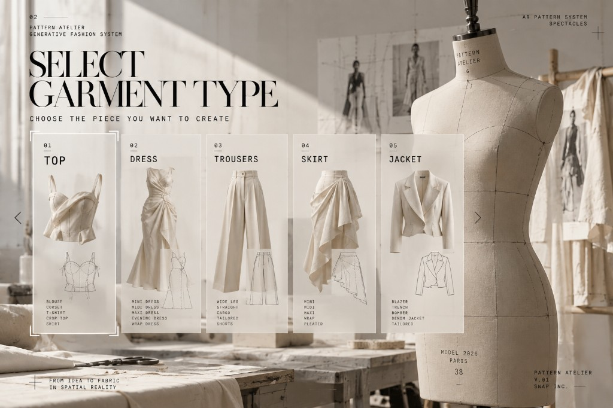

  

  <strong>PATTERN ATELIER</strong> · Generative Fashion System 
  <em>From idea to fabric in spatial reality · Snap Spectacles</em>

# Pattern Atelier

**AI-powered sewing pattern maker for Snap Spectacles.** Start from any garment, customize it as far as you want, and draft **cut-ready patterns at 1:1 real-world scale** onto fabric in the room.

Publication-safe plates: no human figures in textures; titles and CTAs are native Lens components. See [`docs/compliance/RESUBMIT_FIX.md`](docs/compliance/RESUBMIT_FIX.md).

Patterning is the part of sewing that usually stops people: commercial patterns are expensive and hard to change, paper drafting is slow, and even the 3D path (Clo3D and similar) can take days to produce a usable 2D block. This lens keeps you in a conversation with the spec until the piece is actually yours, then puts the sheet on a table.

  
  &nbsp;
  

  
  &nbsp;
  

## Which repo / which Studio

| Repo | Studio | Hardware | What it is |
|------|--------|----------|------------|
| **This one** ([`urbanpeppermint/pattern-atelier`](https://github.com/urbanpeppermint/pattern-atelier), branch `ls-5.15`) | **Lens Studio 5.15.0.x** | Spectacles **(2024)** | Wearable demo that matches the editorial UI and can place a seeded pattern on a real surface |
| [`floraraffa/pattern-atelier`](https://github.com/floraraffa/pattern-atelier) (`main`) | **Lens Studio 5.23+** | Spectacles (SPECS) | Full CLAD / hackathon line: more languages, PatternAI, illustrations |

Do **not** open the 5.23 `.esproj` in 5.15, or this 5.15 project in 5.23. They are separate projects.

This repository no longer has a `main` 5.23 branch. The higher Studio line lives at [floraraffa/pattern-atelier](https://github.com/floraraffa/pattern-atelier).

## How it works

1. **Landing** — enter the atelier. Language via a minimal **EN ▾** pill (English and Spanish in this demo).
2. **Garment** — top, dress, trousers, skirt, jacket. Start from any piece.
3. **Body / Measure** — woman or man profile, then size / measurements.
4. **Design** — pick silhouette, length, fabric, details; keep a typed or spoken style note. Confirm to continue.
5. **Preview** — approve the look before cutting.
6. **Fabric** — pinch a detected surface; the board sits flat. **Yellow = cut**, **white = seam**. Pinch **MOVE** to slide the sheet on that surface, then **PIN** when position and rotation are right.

An **A · ASSISTANT** strip speaks short guidance (TTS when Remote Service Gateway is configured). No cartoon mascot.

With `AppFlow.demoSeed` on (default for the video take), the dress is a **bodice + circle skirt** at woman M so the fabric shot works without a live pattern-AI call.

## Why it is useful

- **Makers and beginners** — you can get past the draft without years of pattern math or buying a block you cannot really change.
- **Studios and production** — look at the real block in the room before fabric is issued.
- **Maison / couture** — review the piece spatially before atelier time starts.

Fewer purchased envelopes that were never quite right, and fewer samples cut for a version you were going to drop.

## Tech (this 5.15 demo)

- **Lens Studio 5.15.0.x** · Spectacles (2024) · Spectacles Interaction Kit **0.15.0**
- **Remote Service Gateway 1.0.1** — OpenAI speech for the assistant; paste your own tokens (placeholders in git)
- **ASR** for voice input (keyboard fallback in the editor)
- Parametric blocks in-repo: bodice, skirt, circle skirt, sleeve, shirt, plus extra blocks in `MoreBlocks.ts`
- World Query to sit the board on a real surface; grab + pin after placement
- Editorial mockup boards + UI art by [Florencia Raffa](https://github.com/floraraffa) ([@floraraffa](https://github.com/floraraffa))

Packages and pins: [`PACKAGES.md`](PACKAGES.md). Rebuild notes: [`docs/5.15-demo/README.md`](docs/5.15-demo/README.md).

## Setup

1. Clone [`urbanpeppermint/pattern-atelier`](https://github.com/urbanpeppermint/pattern-atelier) and check out **`ls-5.15`**.
2. Open **`PatternAtelier_5.15.esproj`** in **Lens Studio 5.15.0.x** (often `Lens Studio 2.app` on this machine). Not 5.23.
3. Confirm Asset Library packages: SIK **0.15.0**, RSG **1.0.1**. Do not copy `Packages/` from the 5.23 project.
4. Select **RemoteServiceGatewayCredentials** and paste your own **openAIToken** (and others if you use them). Git only has `"[INSERT … TOKEN HERE]"` placeholders.
5. Refresh Preview, or push to Spectacles (2024).

If Lens Studio reports a YAML parse error on `Assets/Scene.scene` after clone, you are on a commit older than the credential-line fix — pull the latest `ls-5.15`.

## 5.23 / SPECS line

The CLAD Summer Hackathon build (Lens Studio **5.23**, 11 languages, live PatternAI, Snap3D / image models) is documented here:

- Repo: [floraraffa/pattern-atelier](https://github.com/floraraffa/pattern-atelier)
- Open that project only in **Lens Studio 5.23+**

## Contributors

- [@urbanpeppermint](https://github.com/urbanpeppermint) — Spectacles 2024 / Lens Studio 5.15 demo
- [Florencia Raffa](https://github.com/floraraffa) ([@floraraffa](https://github.com/floraraffa)) — editorial UI, 5.23 CLAD line, co-creator

## License / credentials

Do not commit Remote Service Gateway tokens or `spk_debug_key.pem`. Keep secrets in the Lens Studio credentials inspector on your machine.
